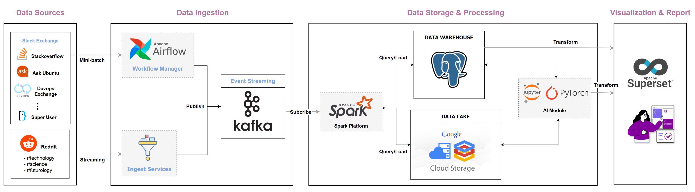
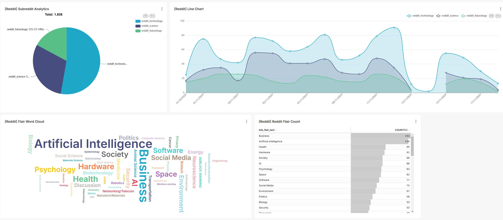
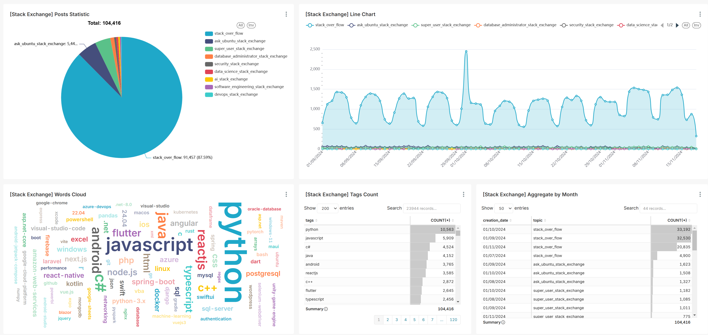

# Realtime Social Media Analysis
This project is designed to extract valuable insights from social media platforms, with a particular focus on Reddit and Stack Exchange. Leveraging the vast amount of user-generated content on these platforms, the project aims to identify and analyze trending topics, discussions, and emerging themes. By utilizing Big Data and natural language processing (NLP) techniques, the project will uncover real-time conversations that are gaining traction within the science and technology domains.

## System Architecture


## Prerequisites
- Apache Spark >= `3.5.0`
- Apache Airflow >= `2.8.0`
- PostgreSQL version `15`

## How to run ?
```
# Start infrastructure (Kafka & Kafdrop)
docker compose -f docker-compose.infra.yml up -d 

# Start related services
docker compose -f docker-compose.services.yml up -d
```

## Dashboard Results

*Reddit Dashboard*
</br>
</br>
</br>

*Stack Exchange Dashboard*

